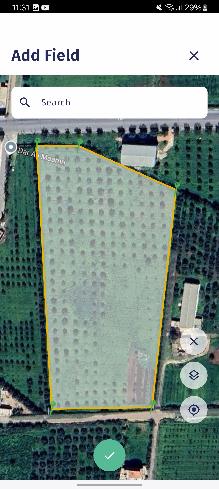
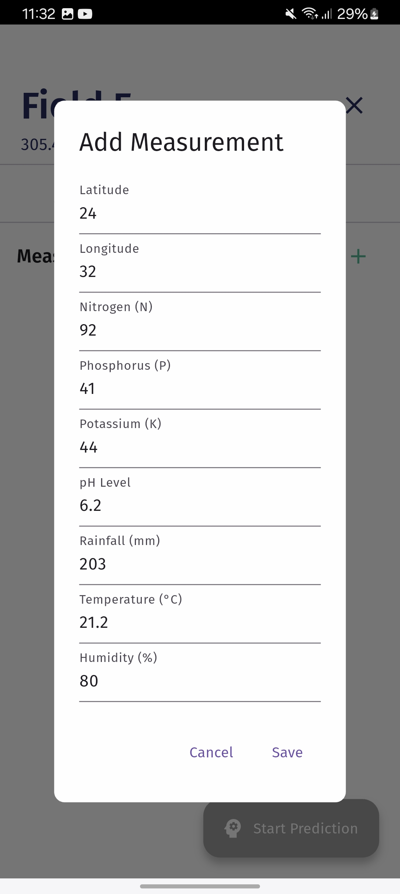
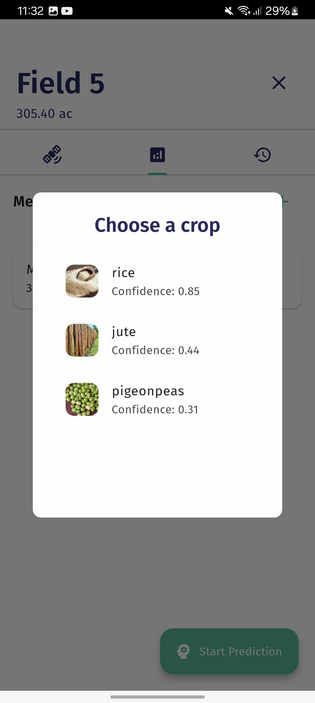
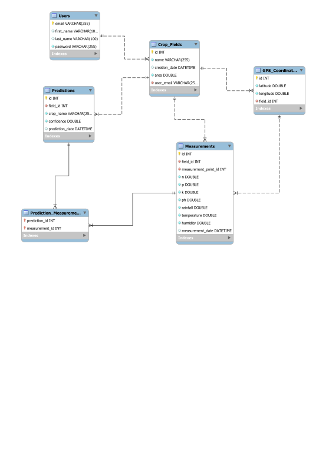
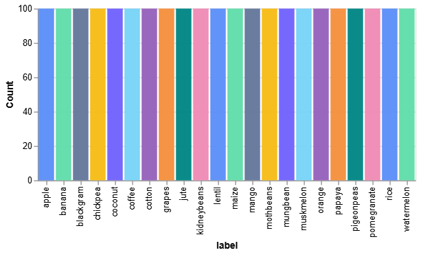
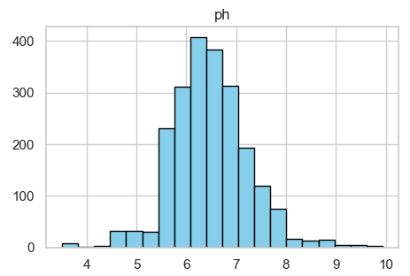
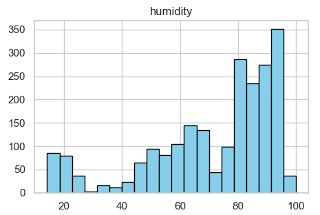
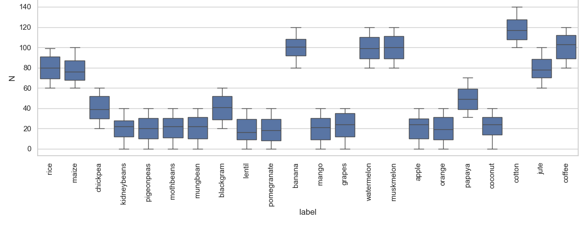
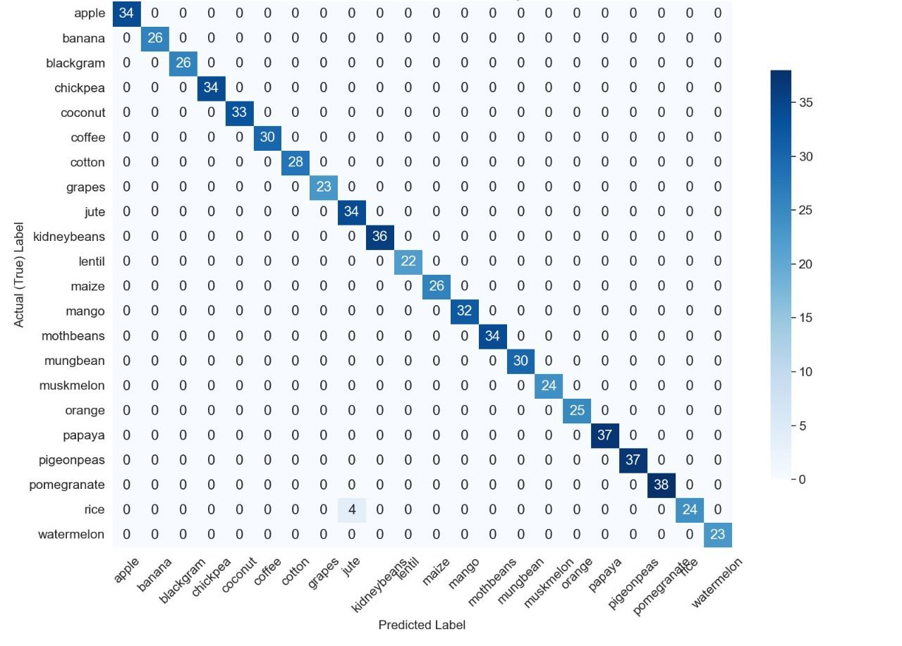

# SustainCropAdvisor

**AI-Powered Crop Recommendation System for Sustainable Agriculture**

> *Developed as part of a final-year Bachelor's thesis in Computer Science.*

---

## Overview

**SustainCropAdvisor** is an intelligent system designed to help farmers make data-driven decisions. By analyzing real soil and environmental metrics collected from sensors, the system predicts the top three optimal crops for a specific field.

This project integrates a robust **Machine Learning** pipeline, a **Flask** backend, a **MySQL** database, and a user-friendly **Flutter** mobile application to provide a complete agricultural solution.

---

## Key Features

### Machine Learning Engine
* **7-Point Analysis:** Predicts crops based on Nitrogen (N), Phosphorus (P), Potassium (K), pH, Moisture, Temperature, and Rainfall.
* **High Accuracy:** The final Random Forest model achieves **99.6% accuracy**.
* **Robustness:** Trained on real agricultural datasets and validated against overfitting using GridSearchCV.

### Mobile Application (Flutter)
* **Interactive Maps:** Define fields and locations directly on a map using GPS coordinates.
* **Instant Analysis:** Input measurements from NPK sensors and get immediate crop recommendations.
* **History Tracking:** View past predictions and soil health logs to assist with crop rotation.

### Backend & Database
* **Secure API:** Flask-based REST API handling user authentication and data processing.
* **Data Persistence:** MySQL relational database stores user profiles, geospatial field data, and historical measurements.

---

## User Interface

| **Field Mapping** | **Soil Analysis** | **Prediction Results** |
|:---:|:---:|:---:|
|  |  |  |
| *Farmers can define field boundaries on the map* | *Easy input for N-P-K and environmental data* | *Top 3 recommended crops with confidence scores* |

> **Note:** The mobile interface was developed using **Flutter**, ensuring a smooth experience on both Android and iOS devices.

---

## System Architecture

The system follows a modular 4-tier architecture:

1.  **Client:** Flutter Mobile App (User Interface)
2.  **API:** Flask REST Server
3.  **Processing:** Scikit-learn ML Model
4.  **Storage:** MySQL Relational Database

### Database Schema
The system uses **MySQL** to manage relational data. The database is structured into five main entities to ensure data integrity and geospatial tracking:

* **Users:** Stores authentication data (first name, last name, email, password).
* **Crop_Fields:** Manages field metadata (name, area, owner).
* **GPS_Coordinates:** Links specific latitude/longitude points to fields.
* **Measurements:** Stores the 7 environmental parameters collected from sensors.
* **Predictions:** Logs the output of the ML model (crop name, confidence score).

## Machine Learning Details

### Methodology
To ensure robustness, the model was trained using the **"Machine Learning in Agriculture"** dataset from Kaggle (~2200 samples).
https://www.kaggle.com/datasets/dhamur/machine-learning-in-agriculture
* **Validation Strategy:** The data was split into **70% training** and **30% testing**.
* **Tuning:** Hyperparameters were optimized using **GridSearchCV**.

### Data Exploration and Cleaning
Before training, we performed **Exploratory Data Analysis (EDA)** to understand the data distribution and ensure model reliability:

* **Class Balance:** The dataset is well balanced across different crop types, ensuring the model does not favor one class over another during training.  
   
  

* **Feature Distribution:** We analyzed the spread of key features such as pH and Humidity to identify value ranges and potential outliers.  
  

    
     
  

* **Nutrient Analysis:** We visualized nutrient requirements for different crops. For example, coffee and cotton have distinct Nitrogen footprints compared to legumes like chickpea.  
   
  

### Comparative Analysis
We evaluated four supervised learning algorithms to identify the most accurate model for this domain. The results below highlight the performance differences:

| Model | Accuracy | Precision | Recall | F1-Score |
| :--- | :--- | :--- | :--- | :--- |
| **Random Forest (Selected)** | **0.996** | **0.991** | **0.991** | **0.991** |
| Naive Bayes | 0.995 | 0.994 | 0.994 | 0.994 |
| SVM | 0.990 | 0.983 | 0.983 | 0.983 |
| k-NN | 0.978 | 0.971 | 0.971 | 0.971 |

**Why Random Forest?**
It demonstrated the highest accuracy and stability across different crop classes, proving robust against overfitting compared to other models.

### Confusion Matrix
The confusion matrix for the Random Forest model demonstrates excellent class separation with minimal misclassification between similar crop types.

---

## Technologies Used

| Category | Technologies |
| :--- | :--- |
| **Frontend** |   |
| **Backend** |   |
| **ML & Data** |    |
| **Database** |  |
| **Tools** |   |

---

## Authors

* **Sofiane Taleb**
* **Yacine Saidi**
